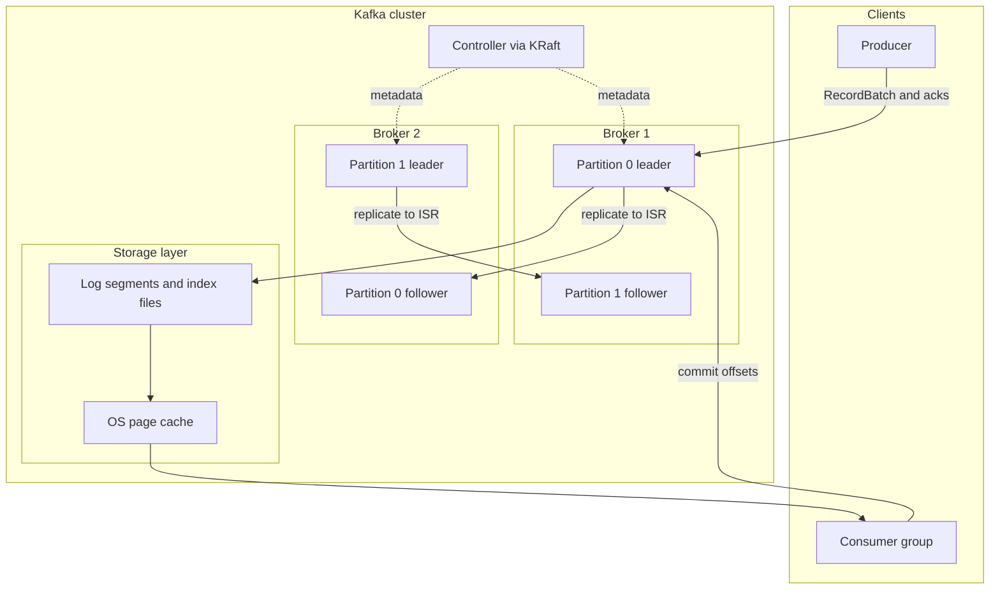

# Apache Kafka

**Тип:** распределённый брокер сообщений / **log**-платформа

## В контексте вики

В [Designing Data-Intensive Applications](../sources/designing-data-intensive-applications.md), [Kafka in Action](../sources/kafka-in-action.md) и [Kafka Official Documentation](../sources/kafka-official-documentation.md) Kafka рассматривается как центральная event backbone система для двух доменов:

- **Java Backend**: async integration, event-driven workflows, outbox/retry/DLQ, scalable consumers.
- **Data Engineering**: CDC transport, replay window, ingestion buffer между источниками и аналитическими движками.

## Architecture at a glance

Kafka разделяет data plane (чтение/запись событий) и control plane (управление метаданными, лидерами и назначениями partition), что критично для понимания аварийных сценариев.

## Ключевые характеристики

| Характеристика | Суть |
|----------------|------|
| **Topic / Partition** | Topic — логический канал. Partition — единица параллелизма и ordering. Сообщения внутри partition — строго упорядочены по offset. |
| **Storage internals** | Partition хранится как append-only сегменты с index файлами; retention/compaction управляют lifecycle данных. |
| **Producer** | Пишет батчами через RecordAccumulator + sender thread. Надёжность: `acks`, `retries`, idempotence, transactions. |
| **Consumer / Consumer Group** | Consumer group — набор consumer'ов, читающих topic. Одна partition → один consumer в группе. Rebalance eager/cooperative. |
| **Offset** | Позиция consumer'а в partition. Consumer коммитит offset; при рестарте — продолжает с последнего committed offset. |
| **Replication (ISR, HW, LEO)** | Каждая partition имеет leader + ISR. Комбинация `acks=all` + `min.insync.replicas` определяет durability; HW/LEO влияют на безопасное чтение и failover. |
| **Retention / Compaction** | Time/size retention для history; compaction для latest-value state по ключу. |
| **KRaft controller** | Замена ZooKeeper для metadata management: Kafka сама управляет control plane через Raft quorum. |
| **Schema governance** | Schema Registry (внешний сервис) снижает риск breaking schema changes в event contracts. |
| **Kafka Streams ecosystem** | Kafka выступает runtime-фундаментом для Kafka Streams: input/output/repartition/changelog topics, транзакции EOS v2 и stateful processing в JVM-приложениях. |
| **Observability** | JMX metrics, consumer lag, ISR health, rebalance behavior — базовые сигналы для production SLO. |

## Когда Kafka vs альтернативы

| Система | Когда выбирать | Ограничение относительно Kafka |
|---------|----------------|--------------------------------|
| **RabbitMQ** | task/routing messaging, где не нужен долгий replay | слабее модель event log/history |
| **Redis Streams** | lightweight messaging внутри одного сервисного контура | слабее масштаб как backbone streaming platform |
| **NATS** | ultra-low-latency pub/sub и простая messaging fabric | иная durability/replay модель в зависимости от режима |
| **Pulsar** | multi-tenant streaming с разделением compute/storage | выше operational complexity для части команд |
| **AWS Kinesis** | managed cloud streaming без self-hosted ops | vendor lock-in и ограничения managed сервиса |

## Типичные вопросы на интервью

**Q: Как Kafka гарантирует порядок сообщений?**
A: Порядок гарантирован **внутри partition**. Глобального порядка между partitions нет. Для ordering по entity — использовать entity ID как partition key (все события одной сущности в одной partition).

**Q: Что такое consumer group и как работает rebalance?**
A: Consumer group — набор consumer'ов, совместно читающих topic. Каждая partition назначается ровно одному consumer'у в группе. При добавлении/удалении consumer'а — **rebalance**: partitions перераспределяются. Во время rebalance — кратковременная остановка обработки. Cooperative rebalance (incremental) — минимизирует stop-the-world.

**Q: Что такое acks=all и min.insync.replicas?**
A: `acks=all` — producer ждёт подтверждения от **всех ISR** (in-sync replicas). `min.insync.replicas=2` — broker отклоняет writes, если ISR < 2. Комбинация: гарантия, что данные записаны минимум на 2 реплики. Trade-off: latency выше, но data loss при single-broker failure исключён.

**Q: Чем compacted topic отличается от обычного?**
A: Обычный — retention по времени/размеру, старые сообщения удаляются целиком. **Compacted** — Kafka хранит **последнее значение по ключу**; старые версии удаляются при compaction. Применение: changelog (CDC), latest state of entity, конфигурации. По сути — distributed key-value store с историей.

**Q: Как Kafka используется в data engineering pipeline?**
A: 1) **CDC transport**: Debezium → Kafka → DWH. 2) **Event bus**: микросервисы публикуют события, analytics consumer'ы читают. 3) **Buffer/decoupling**: между ingestion и processing (Spark/Flink/ClickHouse Kafka Engine). 4) **Stream processing**: Kafka Streams, ksqlDB, Flink читают и пишут в Kafka.

**Q: Что такое exactly-once в Kafka?**
A: **Idempotent producer** (`enable.idempotence=true`) — дедуп на уровне broker (no duplicates при retry). **Transactional producer** — атомарная запись в несколько partitions/topics. **Consumer** — `read_committed` для чтения только committed сообщений. Вместе — effectively once semantics **внутри** Kafka. За пределами (sink) — нужен idempotent consumer.

**Q: Что мешает Kafka дать строгий exactly-once во внешний sink?**
A: Kafka может обеспечить сильные гарантии внутри своей логики (idempotence + transactions), но не управляет атомарностью записи в внешнюю DB/API. На границе всё равно нужны idempotent sink и/или outbox/inbox паттерны.

**Q: Когда `acks=all` + `min.insync.replicas` всё равно может закончиться потерей данных?**
A: При неправильной election-политике (например, unclean leader election), severe multi-node failure и/или операционных ошибках (force reconfiguration) можно потерять подтверждённые данные. Эти настройки снижают риск, но не делают систему неуязвимой к любому сценарию.

**Q: Когда Kafka не лучший выбор?**
A: Когда нужен небольшой routing-heavy queue use-case без требований к replay/history, либо когда operational overhead Kafka непропорционален задаче. В таких случаях RabbitMQ/NATS/managed alternatives могут быть рациональнее.

**Q: KRaft vs ZooKeeper в эксплуатации?**
A: KRaft упрощает архитектуру (меньше внешних компонентов), но требует зрелого мониторинга controller quorum и metadata-path. Это улучшение ops-модели, а не «магическое» снятие всех broker-проблем.

## Связи

- [Kafka Storage and Log Internals](../concepts/kafka-storage-and-log-internals.md)
- [Kafka Replication and ISR](../concepts/kafka-replication-and-isr.md)
- [Kafka Controller and KRaft](../concepts/kafka-controller-and-kraft.md)
- [Kafka Delivery Semantics and Transactions](../concepts/kafka-delivery-semantics-and-transactions.md)
- [Kafka Topic Design and Compaction](../concepts/kafka-topic-design-and-compaction.md)
- [Kafka Schema Registry and Evolution](../concepts/kafka-schema-registry-and-evolution.md)
- [Kafka Producer Internals and Tuning](../concepts/kafka-producer-internals-and-tuning.md)
- [Kafka Consumer Internals and Offsets](../concepts/kafka-consumer-internals-and-offsets.md)
- [Kafka Backend Patterns: Outbox, DLQ, Retry](../concepts/kafka-backend-patterns-outbox-dlq-retry.md)
- [Kafka Observability and Production Gotchas](../concepts/kafka-observability-and-production-gotchas.md)
- [Kafka in DE Pipelines](../concepts/kafka-in-de-pipelines.md)
- [Kafka Connect Fundamentals](../concepts/kafka-connect-fundamentals.md)
- [Kafka Streams](kafka-streams.md)
- [Kafka Streams vs Flink](../comparisons/kafka-streams-vs-flink.md)
- [Kafka Streams vs Kafka Consumer](../comparisons/kafka-streams-vs-kafka-consumer.md)
- [Kafka vs RabbitMQ](../comparisons/kafka-vs-rabbitmq.md)
- [Replication](../concepts/replication.md)
- [Partitioning](../concepts/partitioning.md)
- [Stream Processing](../concepts/stream-processing.md)
- [CDC: Debezium → Kafka → ClickHouse](../concepts/cdc-debezium-analytics-pipeline.md)
- [ClickHouse + Kafka Ingestion](../concepts/clickhouse-kafka-ingestion.md)