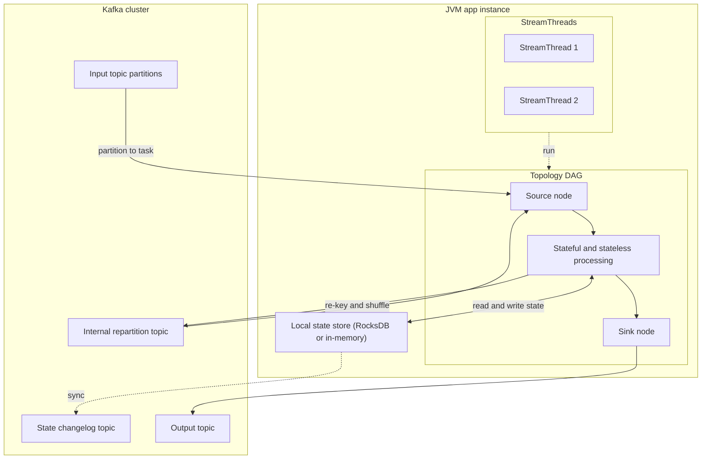

# Kafka Streams

**Тип:** stream processing library for JVM (stateful, embedded runtime)

## В контексте вики

В книге [Kafka Streams in Action, Second Edition](../sources/kafka-streams-in-action.md) Kafka Streams показан как способ строить stateful stream processing прямо внутри backend-сервиса: без отдельного compute-кластера, но с production-семантикой времени, state и exactly-once. В вики это связующее звено между [Apache Kafka](apache-kafka.md), [Stream Processing](../concepts/stream-processing.md) и практикой app-centric streaming.

## Architecture at a glance

## Ключевые характеристики

| Характеристика | Суть |
|----------------|------|
| **Embedded runtime** | Запускается как часть вашего JVM-приложения, без отдельного processing-кластера. |
| **Topology model** | Логика описывается как DAG source/processor/sink через DSL или Processor API. |
| **Stateful processing** | Локальные state stores + changelog topics для восстановления и failover. |
| **KStream/KTable duality** | Поддержка event stream и materialized table-модели в одном API. |
| **Exactly-once v2** | Транзакционный read-process-write цикл через Kafka transactions. |
| **Operational simplicity** | Проще стартовать для Java backend-команд, уже использующих Kafka. |
| **Interactive Queries** | Возможность читать materialized state прямо из приложения. |

## Kafka Streams vs alternatives

| Сценарий | Kafka Streams | Альтернатива |
|----------|---------------|--------------|
| App-centric stream processing | Сильный fit | Flink избыточен для простых сервисных пайплайнов |
| Сложные DE pipeline и мощный event-time orchestration | Ограничен моделью embedded runtime | Flink даёт более мощный engine-level контроль |
| Простой consumption без joins/state | Может быть overkill | Нативный Kafka Consumer API |
| SQL-first streaming для аналитиков | Требует кода на JVM | ksqlDB удобнее для декларативного SQL-слоя |

## Типичные вопросы на интервью

**Q: Почему Kafka Streams часто выбирают backend-команды, а не сразу Flink?**  
A: Ниже операционный порог: не нужен отдельный compute-кластер, всё живёт в привычном lifecycle JVM-сервиса, при этом сохраняются stateful primitives и EOS.

**Q: Что является unit параллелизма в Kafka Streams?**  
A: `Task`, обычно привязанный к source partition. `StreamThread` исполняет один или несколько tasks внутри инстанса.

**Q: Где хранится state и как переживаются падения?**  
A: Локально (часто RocksDB), а изменения дублируются в changelog topics. При failover state восстанавливается на новом инстансе.

**Q: Что именно гарантирует exactly_once_v2?**  
A: Согласованный результат read-process-write внутри Kafka границы: output и offsets коммитятся транзакционно.

**Q: Когда Kafka Streams — плохой выбор?**  
A: Когда нужна сложная многошаговая DE-оркестрация, богатые event-time механики или независимый lifecycle крупной потоковой платформы.

**Q: Для чего нужны Interactive Queries?**  
A: Для low-latency доступа к materialized state как к локальному read-model, с маршрутизацией запроса на инстанс-владельца ключа.

## Связи

- [Kafka Streams Architecture](../concepts/kafka-streams-architecture.md) — topology, tasks, threads.
- [Kafka Streams: KStream, KTable, GlobalKTable](../concepts/kafka-streams-kstream-and-ktable.md) — программная модель данных.
- [Kafka Streams State Stores and Changelog](../concepts/kafka-streams-state-stores-and-changelog.md) — state и восстановление.
- [Kafka Streams Exactly-Once](../concepts/kafka-streams-exactly-once.md) — семантика доставки.
- [Kafka Streams vs Flink](../comparisons/kafka-streams-vs-flink.md) — сравнение stream engines.
- [Kafka Streams vs Kafka Consumer](../comparisons/kafka-streams-vs-kafka-consumer.md) — выбор уровня абстракции.
- [Apache Kafka](apache-kafka.md) — transport и transactional foundation.
