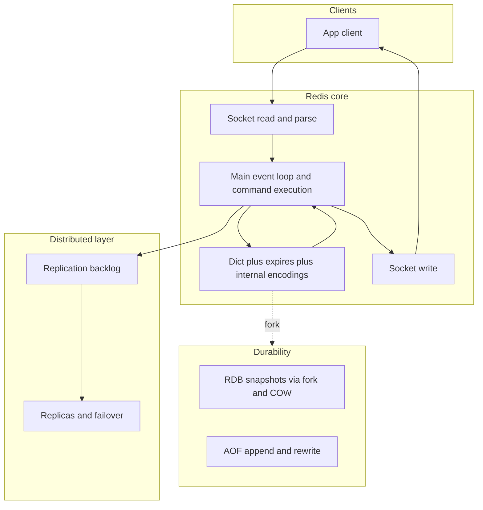

# Redis

**Тип:** in-memory key-value datastore / cache / lightweight message and data-structure server

## В контексте вики

В [Redis in Action](../sources/redis-in-action.md) и [Redis Official Documentation](../sources/redis-official-documentation.md) Redis рассматривается как низколатентный слой между приложением и долговременным хранилищем: кэширование, счётчики, rate limiting, очереди задач, coordination и ephemeral state.

В доменной структуре вики Redis пересекает **Java Backend** (application cache/session/rate limiting/locks) и **Foundations** (internals, replication, failover, consistency trade-offs).

## Architecture at a glance

Команды исполняются последовательно в main loop (простая atomicity модель), а I/O, durability и replication добавляют масштабируемость и отказоустойчивость с соответствующими trade-offs по latency, memory и consistency.

## Ключевые характеристики

| Характеристика | Суть |
|----------------|------|
| **In-memory first** | Данные хранятся в RAM -> latency обычно 0.1-1 ms. Trade-off: память дороже диска, объём ограничен. |
| **Богатые структуры** | Не только `GET/SET`: Hash, List, Set, Sorted Set, Bitmap, HyperLogLog, Streams. Это позволяет моделировать бизнес-операции без внешних join'ов. |
| **Single-threaded command execution** | Команды выполняются последовательно в event loop (с I/O multiplexing). Redis 6+ добавляет I/O threads, но не параллельное исполнение command logic. |
| **Object encodings** | Внутренние encodings (`embstr/raw`, `listpack`, `quicklist`, `intset`, `skiplist+hashtable`) снижают memory footprint, но влияют на latency при conversion. |
| **Persistence options** | RDB snapshots и/или AOF log. Выбор = trade-off между durability, latency и скоростью recovery. |
| **Replication & HA** | Master-replica replication, Redis Sentinel для failover, Redis Cluster для sharding + HA. |
| **Fork + COW cost model** | Snapshot/rewrite через `fork()` и copy-on-write: сохраняется доступность во время persistence, но возможен memory spike при активных writes. |
| **TTL, expiration и eviction** | Lazy + active expiration, `maxmemory` и политики (`allkeys-lru/lfu`, `volatile-*`) определяют поведение под memory pressure. |
| **Replication backlog** | Размер backlog влияет на вероятность partial vs full resync и на стоимость сетевых сбоев. |
| **Atomic operations** | MULTI/EXEC, Lua scripts, optimistic locking (`WATCH`) для multi-step операций. |

## Когда Redis vs альтернативы

| Система | Когда лучше выбирать | Ограничение относительно Redis |
|---------|----------------------|--------------------------------|
| **Memcached** | максимально простой distributed cache, только key-value + TTL | нет rich data structures и встроенной persistence/HA модели |
| **KeyDB/Dragonfly** | нужна совместимость с Redis API и иная модель performance/concurrency | миграционный риск, экосистема/операционные отличия |
| **Hazelcast/Infinispan** | in-memory data grid ближе к JVM-экосистеме | выше сложность и другой operational профиль |

## Типичные вопросы на интервью

**Q: Redis — это database или cache?**  
A: И то, и другое, но по инженерной роли чаще cache/fast state store. Redis даёт persistence (RDB/AOF), replication и failover, поэтому может хранить важные данные, но при строгих durability/consistency требованиях обычно используется вместе с primary DB (PostgreSQL/MySQL), а не вместо неё.

**Q: Почему Redis быстрый?**  
A: 1) In-memory storage, 2) простой wire protocol, 3) single-threaded execution без lock contention на уровне команд, 4) компактные структуры данных. Основное ограничение — RAM и network bandwidth, а не CPU на типичных workload'ах.

**Q: Чем Sentinel отличается от Cluster?**  
A: Sentinel решает **HA без шардирования**: мониторинг, election, failover master'а. Cluster решает и **шардирование, и HA**: ключи распределены по hash slots (16384), каждый slot имеет master/replica. Если нужен один dataset > RAM одного узла, нужен Cluster.

**Q: Когда Redis нельзя использовать как единственный storage?**  
A: Когда критичны строгие ACID-транзакции, сложные ad-hoc запросы/joins, долгий retention большого объёма данных на диске или жёсткая согласованность между многими сущностями. Redis лучше как быстрый state/cache-слой, а system-of-record — в реляционной/документной БД.

**Q: Как выбрать между RDB и AOF?**  
A: RDB — компактные snapshots, быстрый restart, но возможна потеря данных между snapshot'ами. AOF — лучший durability profile (особенно `appendfsync everysec/always`), но больше write amplification и размер файла. На практике часто включают оба: RDB для быстрого восстановления, AOF для меньшего data loss window.

**Q: Что мешает Redis быть полностью multi-threaded для команд?**  
A: Полный multi-thread command execution усложняет синхронизацию структур данных, создаёт lock contention и повышает хвост latency при конкурентных write. Текущий дизайн Redis оптимизирует предсказуемость и простую atomicity модель; масштабирование достигается шардированием и репликацией.

**Q: Как правильно мониторить Redis в production?**  
A: Минимальный набор: command latency (p95/p99), `SLOWLOG`, memory (`used_memory`, RSS, fragmentation), eviction rate, replication lag/resync, cluster redirects (`MOVED/ASK`), hot keys и script runtime. Важны не только средние метрики, но и tail behavior и редкие spikes.

**Q: Когда Redis Cluster не подходит и нужен другой инструмент?**  
A: Когда нужны строгие транзакционные гарантии между множеством ключей/шардов, длинный durable event log с масштабным replay или coordination semantics уровня consensus (leases/fencing). Тогда Redis остаётся speed layer, а system-of-record/coordination выносится в другие системы.

## Связи

- [Redis Data Structures and Modeling](../concepts/redis-data-structures-and-modeling.md)
- [Redis Advanced Data Structures](../concepts/redis-advanced-data-structures.md)
- [Redis Internals: Event Loop and Encodings](../concepts/redis-internals-event-loop-and-encodings.md)
- [Redis Memory Management and Eviction](../concepts/redis-memory-management-and-eviction.md)
- [Redis Persistence: RDB vs AOF](../concepts/redis-persistence-rdb-vs-aof.md)
- [Redis Replication, Sentinel and Cluster](../concepts/redis-replication-sentinel-cluster.md)
- [Redis Caching Patterns and Consistency](../concepts/redis-caching-patterns-and-consistency.md)
- [Redis Distributed Locks](../concepts/redis-distributed-locks.md)
- [Redis Rate Limiting Patterns](../concepts/redis-rate-limiting-patterns.md)
- [Redis Pub/Sub and Streams](../concepts/redis-pubsub-and-streams.md)
- [Redis Observability and Production Gotchas](../concepts/redis-observability-and-production-gotchas.md)
- [Redis vs Memcached](../comparisons/redis-vs-memcached.md)
- [Distributed Systems Pitfalls](../concepts/distributed-systems-pitfalls.md)
